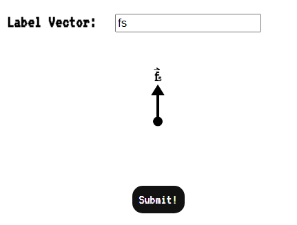

# Free Body Diagram: The Game

<figure>
  
</figure>

# Table of Contents
1. [Overview](#overview) 
2. [Game Modes](#game-modes) 
    1. [Study Mode](#study)
    2. [Score Mode](#score)
    3. [Test Mode](#test)
3. [How to Play](#how-to-play) 
    1. [Progress Panel](#progress-panel)
    2. [Question Panel](#question-panel)
    3. [Vector Panel](#vector-panel)
    4. [FBD Panel](#fbd-panel)
4. [Brightspace/D2L Integration](#brightspace-integration)
5. [Creating a Custom Question](#custom-questions)
6. [Credits](#credits)
7. [To-do Lists](#to-do)

<a id="overview"></a>
# 1. Overview
*Free Body Diagram: The Game* is an educational game designed to help students create free body diagrams for simple statics & dynamics problems. It was designed for a university-level, introductory Physics class, *PHYC1310: Physics In \& Around You I* offered at Dalhousie University every Fall semester. It may be suitable for high school students, too, depending on the curriculum. This game was written in p5.Js as a final project for the *Gamification and Game-Based Learning* studio course led by Dr Kate Thompson. Many of the game elements & aspects of design are owed to the recommended readings in that course. 

The express intention of this software is to make learning statics & dynamics, well... fun! The ability to create a useful free body diagram (FBD) is a fundamental learning objective in the introductory physics curriculum. While it should be the first step in solving any statics & dynamics problem, students often don't get sufficient practice with this technique on their own. On midterms, this often leads to ill-formed expressions of Newton's Laws and thus unphysical calculations of desired quantities. This software addresses this issue by allowing students to create FBDs with real-time feedback. This tests their understanding of the following forces:
- weight, $\vec{F_g}$ or $\vec{w}$ 
- tension, $\vec{F_T}$ or $\vec{T}$
- normal, $\vec{F_N}$ or $\vec{n}$
- friction, $\vec{f_s}$ or $\vec{f_k}$
- generic forces of interaction between objects, e.g. $\vec{F_{B on C}}$. 

By offering students a sandbox to practice the fundamental skill of constructing a free body diagram, students will develop a much more solid foundation for applying Newton's Laws.

In the present release, each level requires the student to create a valid FBD based on a visual aid and written prompt. Future releases will add levels in which the student is given a completed FBD and must construct a correct expression of Newton's 1st or 2nd law along the y- or x-axis based on a selection of magnitudes, signs, and trigonometric functions.

To encourage different levels & styles of play, the software currently has three game modes. In *Study*, the student is given many hints & can take as many attempts at a solution in as much time as they wish. In *Score*, students can shoot for a high score in an arcade-style test of their abilities. Finally, students keen on acing their upcoming statics exam can enter the timed *Test* mode, which provides no hints & provides just one attempt per question. These game modes are described in more detail below.

Want to try it out? Play the current build here:
https://hartery5.github.io/FBDGame/

<a id="game-modes"></a>
# 2. Game Modes
From the main menu, a student can select one of three modes. For a description of gameplay, see "How to Play".

<a id="study"></a>
## i. Study
<figure>
  
</figure>
This mode is intended for students who just want to use the game as a learning tool. They will incur no penalties, are not restricted by time limits, and will have all hints available to them.

<a id="score"></a>
## ii. Score
<figure>
  
</figure>
This mode is intended for students who want to compete for a high score! The student begins the game with 5 health, $10, and a 2 minute time limit per question. For each level that the student completes, they will earn the student cash. Cash can be used to purchase health, hints, or time on subsequent levels. The game is over once the student's health reaches zero, or they complete all available questions.

#### a. Health
Each incorrect answer diminishes the student's health by one. Health can be replenished via the mini-store at a cost of $5 per heart. Health carries over from level to level.

#### b. Hints
Hints can be purchased for $1 each and will be displayed immediately. Hints do *not* carry over from level to level.

#### c. Time
The student initially begins with two minutes to complete the first level. After each level is completed, the time limit of the subsequent level will be 10 seconds less than the previous, until level 10 is reached. All subsequent levels beyond level 10 will have a time limit of just 20 seconds. Additional time can be purchased for $0.50 in 30-second increments. Additional time purchased only applies to the current level.

<a id="test"></a>
## iii. Test
<figure width=400>
  
</figure>
This mode is intended for students who want to simulate the test environment. In this mode, the student is given 10 minutes to complete 10 random questions. The student is given one attempt per question, with feedback after each level informing the student if they were correct or not. After 10 random questions, the student's "grade" is displayed. The letter grade follows Dalhousie's Common Undergraduate Grade Scale: 
https://www.dal.ca/campus_life/academic-support/grades-and-student-records/grade-scale-and-definitions.html

<a id="how-to-play"></a>
# 3. How to Play
Once the game mode is selected, the student can initiate the game via the "Start!" button. The first level will begin immediately unless "Start w/ Tutorial" is selected. The tutorial will essentially walk the student through the following description of the game screen. 

**N.B: coding the tutorial is still on my to-do list.**

The game screen is divided into 4 quadrants:

<a id="progress-panel"></a>
## i. Progress Panel (top left)
The contents of the progress menu depend on which mode the student selected:

#### a. Study Mode
<figure>
  
</figure>
The current level and all hints are displayed.

**N.B.** A planned feature is to include a level-select menu, so that students can which level they want to study.

#### b. Score Mode
<figure>
  
</figure>
The current level, timer, student health, and student cash are displayed. Hints will appear as they are purchased. A mini-store appears at the bottom of the progress menu. The mini-store can be used to purchase Hints, Time, or Health. Items will only appear in the store if the student has enough credits.

#### c. Test Mode
<figure>
  
</figure>
Only the current level & timer are displayed.

<a id="question-panel"></a>
## ii. Question Panel (lower left)
<figure>
  
</figure>
The prompt consists of a visual aid and a verbal prompt. The visual aid will indicate the direction of net acceleration (if the object is accelerating), any known forces, and labels for objects when necessary. The prompt will further explain whether certain forces are already known, whether friction can be ignored, whether gravity can be ignored (e.g. massless pulleys), and which object the student should make an FBD for.

<a id="vector-panel"></a>
## iii. Vector Panel (upper right)
<figure>
  
</figure>
Based on the question prompt, the student must use the vector roses in the top right-hand of the screen to add forces to the FBD in the bottom right corner of the screen. Every time a student selects a vector, they MUST enter a name for the force before selecting another vector.

<a id="fbd-panel"></a>
## iv. FBD Panel (lower right)
<figure>
  
</figure>
A display of the current FBD constructed by the student. For each vector added to the FBD, the user will be prompted to name the vector. Once the student is ready to submit their answer, they can click "Submit!". If correct, the game will transition to the Level Complete screen, otherwise generic feedback will be displayed above.

<a id="brightspace-integration"></a>
# 4. Brightspace/D2L Integration
Instructors wishing to locally integrate this into their Brightspace/D2L page can do so as follows:

1. Pull the repository to make a local copy on your computer.
2. On the Brightspace/D2L page for your course, navigate to Course Admin.
3. From the Course Admin menu, select "Manage Files".
4. Upload the repository to your course files.

You can now create a local link to the game anywhere in the Content section of your course page.

1. After clicking the Upload/Create button, select "Add from Manage Files" from the sub-menu that appears.
2. Use the file viewer to navigate inside the FBDGame folder.
3. Select "index.html".

A link to the game will now be displayed wherever you decided to place it, with the unattractive title "index.html". I recommend renaming it to "FBD Game".

**N.B: I am still investigating ways to collect & store user data (play time, best score, etc.). Currently, I'm not sure how to do this. So, you'll have to use D2L's native features to track use of the game.**

<a id="custom-questions"></a>
# 5. Creating a Custom Question
## i. Designing a Question
You are restricted to FBDs that can be drawn with the vector roses displayed, so carefully think of questions that can be answered using only these vectors. The larger vector rose is a scaled version of the smaller rose by a factor of $\sqrt{2}$ for the obvious purpose of having the larger rose's vectors at 45 degrees being the sums of the smaller rose's horizontal and vertical vectors. At some stage I will add a larger rose by a factor of 2, but this greatly increases the number of possible solutions for questions.


### Image Considerations
Your image should ideally be 350 px × 200 px to avoid any re-sizing issues. JPEG file format is recommended, but static GIFs and PNGs are permitted, too. If you are including a velocity, force, or acceleration vector, make sure it is unambiguously labelled. If there are multiple similar objects (e.g. a row of three boxes), make sure to label them clearly. Solution vectors are only along the vertical axis, horizontal axis, or 45º relative to those axes, so this should be reflected in the drawing.

### Solution Vectors
<figure>
  
</figure>
Solution vectors are indexed **CLOCKWISE** starting with the vector at 0º:
1x vectors: 0 - 7 (inclusive)
$\sqrt{2}$x vectors: 8 - 15 (inclusive)

e.g., gravity should be represented as the vector 2 or 10.

### Question Prompt
Your question prompt should be brief and to the point to avoid display errors, so try to communicate as much information visually as possible. Make sure to specify the system that the student must analyze in the last sentence: "Draw a FBD of **X**".

### Hints
Consider what hints would be helpful for the question. Try not to make these too long, otherwise you will run into display errors.

## ii. Coding a Question
1. Place the image in the assets/img folder.
2. Create a JSON file with your question name, e.g. "NAME_OF_FILE.json", and place it in the "assets/questions/" folder.
3. Format your JSON file as follows:
```
{
    "imgPath": "assets/img/NAME_OF_IMAGE.FILETYPE",
    "description": "A description of your question.",
    "keys": [[sol1_index1, sol1_index2, ...], 
            [sol2_index1, sol2_index2, ...], 
            ...],
    "hints": ["Hint 1",
            "Hint 2", 
            ...]
}
```
The entry "keys" specifies the possible solutions to the problem, where each index is a number from 0 - 15 matching the vectors specified earlies. Keys must be an array of arrays as multiple solutions are possible. For instance, a person sliding a block across a frictionless floor leading to a constant acceleration to the right could be described by any FBD from the following solution array:
```
[[0,2,6],[0,10,14],[8,2,6],[8,10,14]]
```
In the case of a problem with one solution, e.g. a person sliding a box at constant speed across a floor with friction, "keys" must still be an array of arrays:
```
[[0,4,10,14]]
```
Why only code one solution for this problem? We typically teach students that $0\lt\mu\lt1$, so I wouldn't want to accept a solution where $|\vec{F_n}|=|\vec{f_k}|$, e.g.:
```
[[0,2,4,6]]
```
4. In the main directory open "questions.json". This is a simple file with a listing of the current questions. Add the name of your JSON file to the array inside of "questions.json".

Note! Any typos in filenames & paths will result in the program breaking. Error handling is currently very limited.

<a id="credits"></a>
# 6. Credits
The current repository ships with images created by LON-CAPA:
https://www.lon-capa.org/index.html
"The LON-CAPA software is freely available and free (GNU General Public License), and may be modified and adapted. under a GNU Public license."
https://s10.lite.msu.edu/adm/help/What_Is_LON-CAPA.hlp#What_Is_LON_CAPA

These will slowly be replaced, mostly due to issues resizing. All other assets were created by Sean Hartery.

<a id="to-do"></a>
# 7. To-do Lists
### i. Important, low-hanging fruit
1. Add 2x vectors to solution space. This increases the number of problems that could be solved, but adds solutions to previously coded problems.
2. Change FBD anchor point from a dot to an octagon. Add three anchor points per side. This will allow progamming of questions with multiple forces in the same direction.
3. Add more questions. Minimum 20 should be available by Fall 2024.
4. Add a leaderboard to score mode. Unlikely that this will work on GitHub page, but it *should* work on Brightspace if the link is locally hosted. If it's served... ¯\\_(ツ)_/¯.
5. Replace images from LON-CAPA with custom images that fit the size available and correctly show angles at 45 degrees.
6. Check whether site is locally hosted on Brightspace. If so, it may be possible for user to edit a file. This could be a way to log user data and ultimately connect play to grade. 

### ii. Important, high-hanging fruit
1. In study mode, allow student to view question library and select a question to study from that list.
2. Rank the difficulty of questions, so that more difficult questions don't show up until later levels in Score mode.
3. Create a new type of level which requires students to express N<sup>1</sup>L or N<sup>2</sup>L along the x or y axis for a given FBD. I am imagining this Duolingo-style, i.e. getting the student to drag vector magnitudes, signs, and trig functions from a word cloud down to an entry line. This seems... hard?
4. If site is not locally hosted on Brightspace - then must host & serve site. This becomes headache with authentication, passwords, password security... ideally this stays contained in Brightspace.

### iii. Not so important fruit
1. Write different music for different modes.
